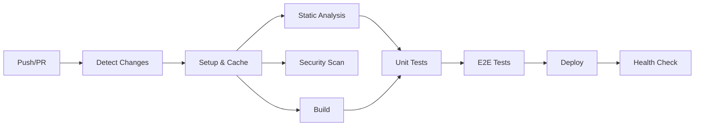

# CI/CD Pipeline Quick Reference

## 🚀 Quick Start

### Required Secrets Checklist

```
☐ NEXTAUTH_SECRET (generate: openssl rand -base64 32)
☐ NEXTAUTH_URL (https://your-domain.vercel.app)
☐ DATABASE_URL (postgresql://...)
☐ ONELOGIN_CLIENT_ID
☐ ONELOGIN_CLIENT_SECRET
☐ ONELOGIN_ISSUER
☐ VERCEL_TOKEN
☐ VERCEL_ORG_ID
☐ VERCEL_PROJECT_ID
```

### Workflow Control

- **Skip CI**: Add `[skip ci]` to commit message
- **Skip deployment**: Add `[skip deploy]` to commit message
- **Manual trigger**: Go to Actions → Select workflow → Run workflow

## 📊 Pipeline Overview



## 🔧 Common Commands

### Local Testing

```bash
# Run linting
npm run lint

# Run type checking
npm run type-check

# Run unit tests
npm test

# Run E2E tests
npm run cypress:run

# Build production
npm run build:production
```

### Debugging CI Issues

```bash
# Test GitHub Actions locally
act -j build

# Clear npm cache
npm cache clean --force

# Verify Cypress
npx cypress verify

# Check Prisma
npx prisma generate
```

## 🚨 Troubleshooting

### Pipeline Failed?

1. **Check which job failed** → Click on the red X
2. **Common fixes**:
   - `npm install failed` → Clear cache in GitHub Actions
   - `Type errors` → Run `npm run type-check` locally
   - `E2E failed` → Check screenshots in artifacts
   - `Deploy failed` → Verify Vercel secrets

### Quick Fixes

```bash
# Fix linting issues
npm run lint:fix

# Fix formatting
npm run format

# Update dependencies
npm update

# Reset everything
rm -rf node_modules package-lock.json
npm install
```

## 📈 Performance Tips

1. **Cache effectively**: Don't change package-lock.json unnecessarily
2. **Use parallel jobs**: Split independent tasks
3. **Skip unchanged**: The pipeline auto-detects file changes
4. **Fail fast**: Fix linting/type errors before pushing

## 🔐 Security Reminders

- Rotate secrets quarterly
- Never commit `.env` files
- Use `[skip ci]` carefully
- Review dependency updates

## 📞 Need Help?

1. Check logs: Actions tab → Failed workflow → Job logs
2. Review docs: `/docs/CI_CD_SETUP_GUIDE.md`
3. Create issue: Label with `ci-cd`

## 🎯 Pipeline Status Badges

Add to README.md:

```markdown


```
