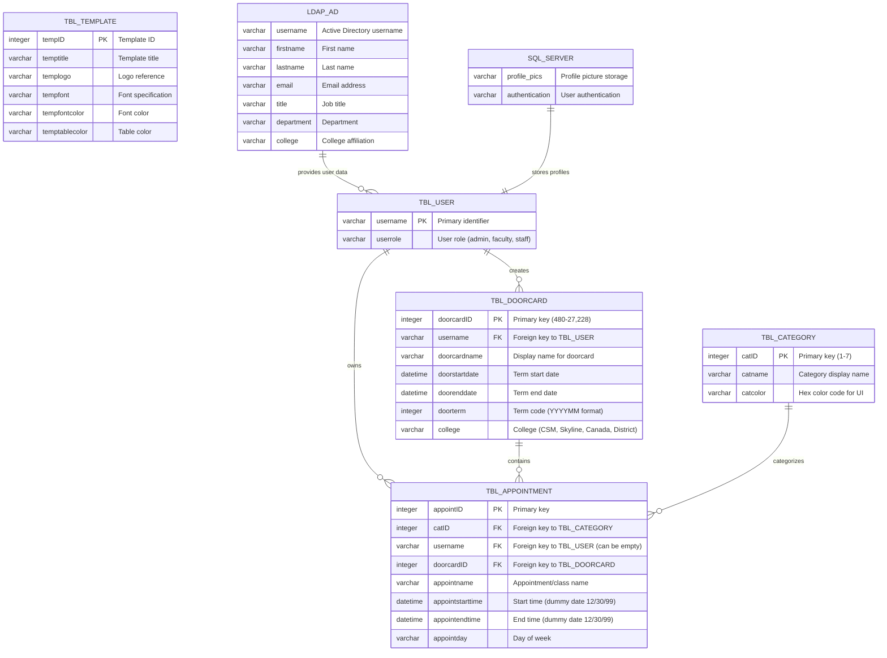
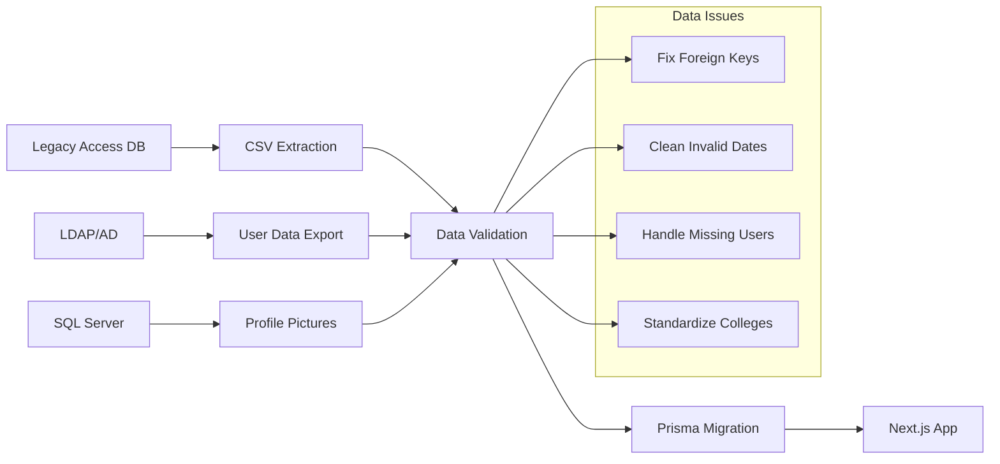

# Old Doorcard Database Schema Diagram

## Access Database Schema (Legacy System)



## Data Statistics & Issues

### Table Record Counts

| Table           | Records | Issues                              |
| --------------- | ------- | ----------------------------------- |
| TBL_USER        | 1       | 99.96% missing (expected: 2,271)    |
| TBL_DOORCARD    | 10,944  | 22 invalid dates, 85+ missing dates |
| TBL_APPOINTMENT | 184,935 | 88,000+ orphaned (53.6% broken FKs) |
| TBL_CATEGORY    | 7       | Complete                            |
| TBL_TEMPLATE    | 0       | Empty file                          |

### Category Distribution

```
Office Hours (#E1E2CA)          █████████████████████████████████████ 37.2%
In Class (#99B5D5)              ███████████████████████████████████   33.4%
Lecture (#D599C5)               ███████████                           10.6%
Lab (#EDAC80)                   ████████                              7.6%
Hours by Arrangement (#99D5A1)  ██████                                6.0%
Reference (#AD99D5)             █████                                 4.8%
[UNDEFINED]                     █                                     0.4%
```

### College Distribution

```
CSM (College of San Mateo)      ████████████████████████████████████████ 45.2%
Skyline                         ██████████████████████████████████       38.1%
Canada                          ███████████████                          16.4%
District                        █                                        0.3%
```

## Critical Data Integrity Problems

### 🔴 Broken Foreign Key Relationships

- **53.6%** of appointments reference non-existent doorcard IDs
- Only **9,370** doorcard IDs exist in both tables
- Complete breakdown of relational integrity

### 🔴 Missing User Data

- Only **1 user** in TBL_USER vs **2,271** users referenced
- **99.96%** of user records missing from export
- Indicates incomplete database export

### 🔴 Data Quality Issues

- **22** records with invalid dates (`01/00/00 00:00:00`)
- **70** appointments with empty usernames
- **792** appointments with undefined categories
- Inconsistent naming conventions

## Architecture Notes

### Legacy System Components

1. **PHP Web Application** (`old-doorcard/public/`)
   - LDAP authentication via `ldap_connection.php`
   - SQL Server integration for profiles
   - Direct database queries in PHP files

2. **Database Access Methods**
   - ODBC connections to SQL Server
   - LDAP queries for user information
   - CSV exports from Access database

3. **Extraction Tools Built**
   - `extract-access-db.py` (Python with mdbtools/pyodbc)
   - `extract-access-db.js` (Node.js with node-adodb)
   - `extract-access-simple.sh` (Bash with mdbtools)

### Migration Path to Modern Stack



## Recommended Actions

1. **🔥 Critical**: Obtain complete user export from Active Directory/LDAP
2. **⚡ High**: Fix foreign key relationships between appointments and doorcards
3. **⚡ High**: Clean invalid date formats and handle empty values
4. **📊 Medium**: Define missing category #7 and standardize college names
5. **🔧 Low**: Implement template system migration (currently unused)

---

**Generated from analysis of Access DB exports in**: `db-items/`, `rejects/`,
and migration scripts in `scripts/`
